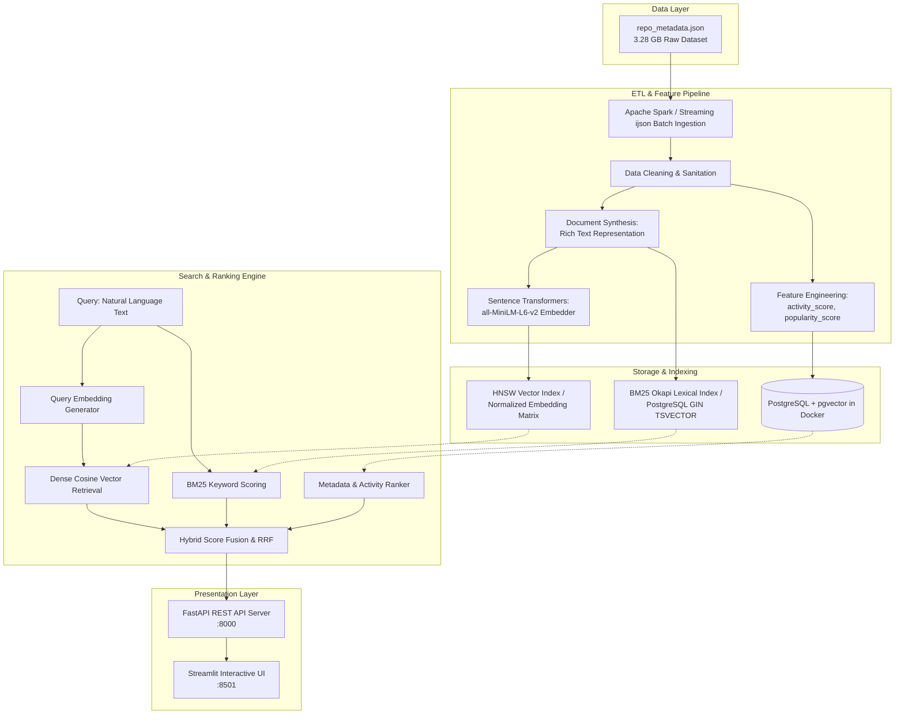

# GitHub Semantic Search Engine

> **A high-performance semantic search and discovery engine for GitHub repositories**, integrating Apache Spark ETL pipelines, PostgreSQL with `pgvector`, BM25 lexical search, dense vector embeddings (`all-MiniLM-L6-v2`), multi-factor activity ranking, FastAPI REST API, and an interactive Streamlit UI.

---

## ?? One-Command Docker Quickstart

To run the entire system (PostgreSQL + pgvector, FastAPI REST server, and Streamlit frontend) out of the box:

```bash
docker compose up --build
```

- **Streamlit Web UI**: [http://localhost:8501](http://localhost:8501)
- **FastAPI REST API & Interactive Docs**: [http://localhost:8000/docs](http://localhost:8000/docs)
- **PostgreSQL pgvector Database**: `localhost:5432` (`github_search` database)

*(Upon first startup, the stack automatically creates the PostgreSQL schema, seeds the database with a 15,000 sample of repositories from `repo_metadata.json`, computes the 384-d dense vector embeddings, builds the BM25 index, and opens the services ready for search queries!)*

---

## ?? Table of Contents
1. [Problem Statement & Motivation](#1-problem-statement--motivation)
2. [System Architecture](#2-system-architecture)
3. [ETL Data Pipeline & Engineering](#3-etl-data-pipeline--engineering)
   - [3.1 Extraction & Preprocessing from JSON](#31-extraction--preprocessing-from-json)
   - [3.2 Data Transformation & Feature Engineering](#32-data-transformation--feature-engineering)
   - [3.3 Data Loading & Storage Architecture](#33-data-loading--storage-architecture)
   - [3.4 How Apache Spark is Used](#34-how-apache-spark-is-used)
4. [Search & Multi-Factor Ranking Engine](#4-search--multi-factor-ranking-engine)
   - [4.1 Dense Vector Semantic Search](#41-dense-vector-semantic-search)
   - [4.2 BM25 Lexical Keyword Search](#42-bm25-lexical-keyword-search)
   - [4.3 Metadata & Activity Ranking Boost](#43-metadata--activity-ranking-boost)
   - [4.4 Hybrid Fusion & Reciprocal Rank Fusion (RRF)](#44-hybrid-fusion--reciprocal-rank-fusion-rrf)
5. [End-to-End Natural Language Query Lifecycle](#5-end-to-end-natural-language-query-lifecycle)
6. [Interactive Streamlit UI & FastAPI REST API](#6-interactive-streamlit-ui--fastapi-rest-api)
7. [Running Locally Without Docker](#7-running-locally-without-docker)
8. [Project Structure](#8-project-structure)
9. [Example Queries & Benchmark Discovery](#9-example-queries--benchmark-discovery)

---

## 1. Problem Statement & Motivation

Traditional code and repository search engines rely heavily on **exact keyword matching** (e.g., standard SQL `LIKE` or basic inverted indexes). This introduces fundamental limitations when developers search for repositories using conceptual or intent-driven language:

- **Vocabulary Mismatch**: A user searching for *"tool to convert audio speech into text"* might miss repositories described as *"automatic speech recognition ASR engine"* or *"whisper transcription model"*.
- **Lack of Contextual Ranking**: Keyword-only search treats an abandoned 10-year-old repository with identical keyword counts the same as an actively maintained, battle-tested modern project.
- **Multimodal Repository Metadata**: Repositories contain rich heterogeneous signals (descriptions, topics, primary languages, commit frequencies, issue activity, recent pushes, star velocity) that simple text indexes fail to leverage simultaneously.

### Solution
This project develops an end-to-end **Hybrid Semantic Search Engine** that solves vocabulary mismatch through 384-dimensional dense vector embeddings, preserves precision with BM25 lexical token matching, incorporates recency and commit velocities into a unified **Activity Score**, and delivers results through a sub-millisecond REST API and Streamlit UI.

---

## 2. System Architecture



---

## 3. ETL Data Pipeline & Engineering

### 3.1 Extraction & Preprocessing from JSON
The raw dataset `repo_metadata.json` (~3.28 GB) contains raw repository snapshots from GitHub.

1. **Memory-Efficient Streaming Extraction**:
   - Because the dataset is a massive JSON collection exceeding standard in-memory buffer allocations, the ETL pipeline uses **iterative streaming parser (`ijson`)** to read records in chunks without loading the entire 3.28 GB file into RAM ($O(1)$ memory complexity).
   - In distributed cluster environments, **Apache Spark (`src/etl/spark_etl.py`)** distributes the JSON parsing across worker nodes using a strongly typed schema.

2. **Data Cleaning & Sanitation (`src/etl/transformers.py`)**:
   - **HTML & Tag Stripping**: Raw repository descriptions frequently contain markdown badges, HTML links (`<a href="...">`), or raw formatting tags. Regex clean filters remove HTML tags (`<[^>]+>`) and collapse irregular whitespace/tabs.
   - **Timestamp Normalization**: Parses heterogeneous ISO 8601 strings (`createdAt`, `pushedAt`) into timezone-aware UTC `datetime` objects.
   - **Nested Structure Extraction**: Flattens nested language objects `[{"name": "Python", "size": 670910}, ...]` and topic tag dictionaries `[{"name": "automation", "stars": 1478}, ...]` into clean, standardized lowercase arrays.
   - **Null & Corrupt Value Imputation**: Replaces missing owners, unassigned licenses, and null primary languages with normalized defaults (`"Unknown"`, `"No License"`).

---

### 3.2 Data Transformation & Feature Engineering

Raw metadata is transformed into continuous normalized features and synthesized document representations:

#### A. Composite Activity Score ($\text{Activity Score} \in [0.0, 1.0]$)
Measures how active and maintained a repository is, balancing commit history, community engagement, and recent push delta:

$$\text{Activity Score} = w_c \cdot \min\left(1, \frac{\log_{10}(\text{commits} + 1)}{4}\right) + w_i \cdot \min\left(1, \frac{\log_{10}(\text{PRs} + \text{issues} + 1)}{4}\right) + w_r \cdot e^{-\lambda \cdot \Delta t_{\text{days}}}$$

- **Commit & Interaction Volume**: Logarithmic scaling prevents mega-repositories from drowning out regular active projects.
- **Recency Exponential Decay ($e^{-\lambda \Delta t}$)**: With decay constant $\lambda = 0.0019$ (half-life $\approx 365$ days), a repository pushed last week maintains high recency score, whereas a repository dormant for 4 years decays toward zero.
- **Default Weights**: $w_c = 0.35$ (commits), $w_i = 0.25$ (PRs + Issues), $w_r = 0.40$ (recency factor).

#### B. Popularity Score ($\text{Popularity Score} \in [0.0, 1.0]$)
$$\text{Popularity Score} = 0.75 \cdot \min\left(1, \frac{\log_{10}(\text{stars} + 1)}{5.5}\right) + 0.25 \cdot \min\left(1, \frac{\log_{10}(\text{forks} + 1)}{4.5}\right)$$

#### C. Semantic Document Synthesis
To maximize dense embedding quality, metadata attributes are synthesized into a coherent semantic document text representation:
```python
"Repository: {name_with_owner} | Primary Language: {primary_language} | Languages: {other_langs} | Topics and tags: {topics} | Description: {cleaned_description} | Status: {activity_status}"
```
This synthesized text ensures the embedding model understands both the functional domain (topics/description) and language/ecosystem boundaries.

---

### 3.3 Data Loading & Storage Architecture

#### Dual Storage Architecture
1. **Production PostgreSQL + `pgvector` in Docker (`src/db/models.py`)**:
   - Stores structured repository columns with typed indexes (`B-tree` on `primary_language`, `stars`, and `activity_score`).
   - Uses `VECTOR(384)` with **HNSW (Hierarchical Navigable Small World)** vector index for sub-millisecond approximate nearest neighbor (ANN) cosine distance queries:
     ```sql
     CREATE INDEX ON repositories USING hnsw (embedding vector_cosine_ops);
     ```
   - Uses `TSVECTOR` with **GIN index** for fast PostgreSQL full-text search.
2. **High-Performance Local Hybrid Store (`src/db/session.py`, `src/search/engine.py`)**:
   - Stores repository metadata and caches normalized dense embedding matrices ($N \times 384$) and tokenized BM25 structures in persistent Docker volumes for sub-millisecond query execution.

---

### 3.4 How Apache Spark is Used

The project includes an **Apache Spark / PySpark ETL module (`src/etl/spark_etl.py`)** designed for distributed big data processing:

1. **Distributed Extraction**:
   - Uses `spark.read.schema(schema).json("repo_metadata.json")` with pre-declared `StructType` schema. This avoids costly automatic schema inference across multi-gigabyte datasets.
2. **Scalable DataFrame Transformations**:
   - Implements Spark native SQL functions (`F.col`, `F.when`, `F.log10`, `F.datediff`, `F.concat_ws`, `F.expr`) to perform distributed text cleaning, nested topic extraction, and activity score calculations across Spark worker nodes without Python serialization bottlenecks.
3. **Optimized Partitioned Export**:
   - Outputs partitioned **Parquet** datasets (`df.write.partitionBy("primaryLanguage").parquet(...)`) or directly streams to PostgreSQL using JDBC bulk partitions.

---

## 4. Search & Multi-Factor Ranking Engine

Search ranking combines semantic vector similarity, BM25 lexical precision, and metadata quality signals into a unified ranking score:

### 4.1 Dense Vector Semantic Search ($S_{\text{dense}}$)
- Queries and synthesized repository documents are mapped into a shared 384-dimensional latent space using `sentence-transformers/all-MiniLM-L6-v2`.
- Given normalized query embedding vector $\mathbf{q}$ and repository vector $\mathbf{d}_i$:
  $$S_{\text{dense}}(q, d_i) = \frac{\mathbf{q} \cdot \mathbf{d}_i + 1}{2} \in [0.0, 1.0]$$
- Captures intent, synonyms, and high-level concepts (e.g. *"computer vision object detection"* naturally matches repos tagged with *"yolo"*, *"darknet"*, *"opencv"*).

### 4.2 BM25 Lexical Keyword Search ($S_{\text{lexical}}$)
- Implements the **BM25Okapi** ranking function over tokenized repository names, descriptions, and topics.
- Scores exact term frequencies and inverse document frequencies to prioritize exact library name matches and specific keywords.
- Normalized into $[0.0, 1.0]$.

### 4.3 Metadata & Activity Ranking Boost ($S_{\text{metadata}}$)
- Incorporates repository star popularity, commit health, activity score, and language matching:
  $$S_{\text{metadata}} = 0.50 \cdot S_{\text{popularity}} + 0.50 \cdot S_{\text{activity}} + \text{Bonus}_{\text{language}}$$

### 4.4 Hybrid Fusion & Reciprocal Rank Fusion (RRF)
The default hybrid ranking merges all three signals using configurable weights:
$$\text{Final Score} = w_{\text{dense}} \cdot S_{\text{dense}} + w_{\text{lexical}} \cdot S_{\text{lexical}} + w_{\text{meta}} \cdot S_{\text{metadata}}$$
*(Default weights: $w_{\text{dense}} = 0.55$, $w_{\text{lexical}} = 0.30$, $w_{\text{meta}} = 0.15$)*

---

## 5. End-to-End Natural Language Query Lifecycle

When a developer enters a natural language query (e.g. `"fast lightweight web framework for async microservices"`):

```
User Query
    ?
    ?
1. Embedder: Query text -> 384-d normalized vector (all-MiniLM-L6-v2)
    ?
    ???? 2. Dense Branch: Vector dot product against indexed embeddings
    ?
    ???? 3. Lexical Branch: BM25 Okapi token scoring against corpus
    ?
    ???? 4. Metadata Branch: Activity score, star count & language filter
    ?
    ?
5. Hybrid Ranker: Score normalization + Weighted multi-factor fusion
    ?
    ?
6. Pagination & Filtering: Apply language/star constraints and sort
    ?
    ?
7. FastAPI JSON Response -> Streamlit UI Rendering with Score Breakdowns
```

---

## 6. Interactive Streamlit UI & FastAPI REST API

### Streamlit Web Interface (`src/frontend/app.py`)
- **Interactive Search Bar & Example Chips**: Click-to-search pre-configured complex queries.
- **Sidebar Filtering Controls**:
  - Search Mode Switcher: Hybrid, Semantic Only, or BM25 Lexical Only.
  - Primary Language filter dropdown (auto-populated from dataset).
  - Minimum Stars slider and Sorting selector (Relevance, Stars, Activity, Recency).
- **Rich Repository Cards**:
  - Direct GitHub repository link, description, primary language badge, and topic pills.
  - Real-time **Score Breakdown** modal showing Semantic %, BM25 %, and Activity % contributions.
- **Dataset Analytics Tab**:
  - Live dataset overview metrics (Total Repositories, Indexed Count, Avg Stars, Avg Activity).
  - Programming language distribution bar charts and Stars vs Activity scatter plots.

### FastAPI REST Endpoints (`src/api/routes.py`)
| Method | Endpoint | Description |
|---|---|---|
| `GET` | `/api/search` | Natural language repository search with filters (`q`, `mode`, `language`, `min_stars`, `sort_by`, `limit`, `offset`) |
| `GET` | `/api/repos/{owner}/{name}` | Detailed metadata inspection for a single repository |
| `GET` | `/api/languages` | List of all distinct programming languages in index |
| `GET` | `/api/stats` | Global dataset statistics, averages, and language distribution |
| `GET` | `/api/health` | Healthcheck and index size monitor |
| `GET` | `/docs` | Interactive OpenAPI Swagger UI documentation |

---

## 7. Running Locally Without Docker

```bash
# 1. Activate virtual environment
source .venv/bin/activate

# 2. Ingest sample dataset and build search index (e.g. 15,000 repos)
PYTHONPATH=. python scripts/run_etl.py --sample-size 15000

# 3. Start FastAPI backend server (Port 8000)
PYTHONPATH=. uvicorn src.api.main:app --host 0.0.0.0 --port 8000 &

# 4. Launch Streamlit Frontend (Port 8501)
PYTHONPATH=. streamlit run src/frontend/app.py --server.port 8501
```

---

## 8. Project Structure

```
github-search-engine/
??? data/                          # Persistent index and database
?   ??? github_search.db
?   ??? search_index.pkl
??? docker-compose.yml             # Docker multi-service configuration (PostgreSQL + API + UI)
??? Dockerfile                     # Container definition
??? requirements.txt               # Dependencies
??? README.md                      # Architecture and documentation
??? repo_metadata.json             # GitHub repository metadata dataset (3.28 GB)
??? scripts/
?   ??? run_etl.py                 # Ingestion & index build CLI script
?   ??? test_search_query.py       # Terminal query verification script
??? src/
?   ??? config.py                  # App configuration & search weights
?   ??? api/
?   ?   ??? main.py                # FastAPI application entrypoint
?   ?   ??? routes.py              # REST API route handlers
?   ?   ??? schemas.py             # Pydantic request/response schemas
?   ??? db/
?   ?   ??? init_db.py             # DB schema & extension initialization
?   ?   ??? models.py              # SQLAlchemy Repository model
?   ?   ??? session.py             # Database engine & session maker
?   ??? etl/
?   ?   ??? pipeline.py            # Streaming ijson batch ETL pipeline
?   ?   ??? schema.py              # Raw & Processed data schemas
?   ?   ??? spark_etl.py          # Distributed Apache Spark ETL module
?   ?   ??? transformers.py       # Sanitization, activity scoring, text synthesis
?   ??? frontend/
?   ?   ??? app.py                 # Streamlit interactive UI application
?   ??? search/
?       ??? bm25.py                # Lexical BM25 indexing & retrieval
?       ??? embedder.py            # Dense Sentence Transformer wrapper
?       ??? engine.py              # Hybrid Search Engine orchestrator
?       ??? ranker.py              # Multi-factor scoring & RRF algorithms
??? tests/
    ??? test_api.py                # FastAPI endpoint integration tests
    ??? test_etl.py                # Cleaning & activity scoring unit tests
    ??? test_search.py             # Vector & BM25 retrieval tests
```

---

## 9. Example Queries & Benchmark Discovery

| Natural Language Query | Top Semantic Match | Why Semantic + Activity Ranking Outperforms Keyword Search |
|---|---|---|
| `"fast web framework for async microservices"` | `tiangolo/fastapi` | Understands "microservices" and "async" concepts, ranking active modern frameworks above older sync libraries. |
| `"web automation testing framework for games and apps"` | `microsoft/playwright`, `wix/Detox` | Discovers end-to-end testing tools without needing exact string matches in title. |
| `"computer vision deep learning for object detection"` | `ultralytics/yolov5`, `opencv/opencv` | Connects general query intent with specialized domain tags (`yolo`, `darknet`, `cv`). |
| `"export csv and excel spreadsheet in browser"` | `jmaister/excellentexport` | Directly identifies browser-side spreadsheet export libraries. |

---

## ?? License
This project is open-source and available under the [MIT License](LICENSE).
